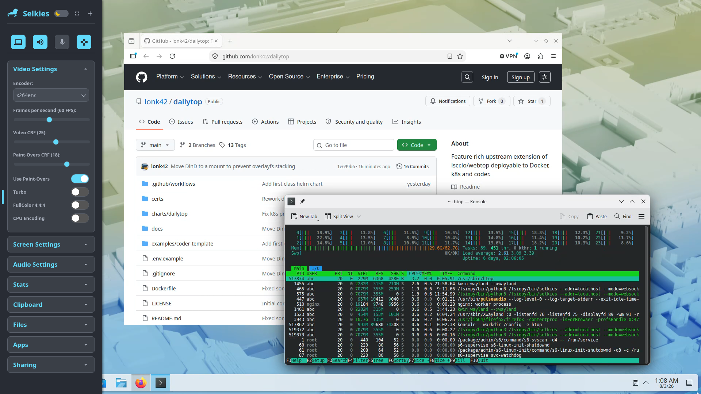

# dailytop

A containerised KDE Plasma desktop in your browser, built on
[LinuxServer's webtop](https://docs.linuxserver.io/images/docker-webtop/) (Fedora KDE /
[selkies](https://github.com/selkies-project/selkies)). Supports several variants
packaged for Kubernetes, [Coder](https://coder.com) workspaces and Docker.



The `k8s` variant, with the selkies dashboard open on its video settings.

## What it adds to webtop

dailytop is a much fatter base including support for a larger variety of desktop tools.

- **Multiple deployment targets.** Single host via compose, Kubernetes, or a Coder
  workspace, selected with `--target`. A [Helm chart](charts/dailytop/README.md) and a
  working [Coder template](examples/coder-template/main.tf) are included.
- **Coder workspace support.** The agent runs as an s6 service rather than the container
  entrypoint. Subdomain apps, no HTTP basic auth, and TLS material kept out of the
  workspace volume.
  [Detail](docs/image-design.md#the-agent-is-a-service-not-the-entrypoint)
- **An unprivileged variant** that runs as an arbitrary non-root uid with no
  capabilities under Kubernetes' `restricted` PodSecurity, with no policy exception.
  [Detail](docs/unprivileged.md)
- **GPU acceleration for Wayland**, and hardware video decode in Firefox. The EGL-on-X11
  platform libraries that decode depends on are driver-locked and injected by neither the
  GPU operator nor `nvidia-container-toolkit`, so the deployment mounts them and a startup
  hook configures glvnd for whichever ones it finds.
  [Detail](docs/image-design.md#firefox-egl-on-x11-then-vaapi)
- **Flatpak support**, with Flathub configured, apps where the KDE menu can find them,
  and bwrap functioning under the NVIDIA container runtime.
- **A KDE lock screen**, optionally engaged at session start and unlocked with an
  account password applied at container start.
  [Detail](docs/image-design.md#the-kde-lock-screen)
- **A cloud and Kubernetes toolkit** in `base`, inherited by every variant: aws, az and
  gcloud; kubectl, helm, oc, k9s and argocd; Terraform and OpenTofu; kustomize, rclone,
  restic and s3cmd; VS Code, Firefox and Chromium.
- **Separable defaults for the stream quality settings.**
  `SELKIES_FRAMERATE` and its siblings set the bounds a client may choose between;
  `SELKIES_<NAME>_DEFAULT` sets where it starts.
  [Detail](docs/image-design.md#defaults-for-selkies-range-settings)
- **Customisable.** Package lists, flatpak lists, tool versions and the base image pin
  are all build args. [Detail](docs/building.md)

## Variants

| Target | What it is | Notable contents |
|---|---|---|
| `base` | Upstream fixes, the CLI toolkit, VS Code. | Firefox, Chromium, gh, aws/az/gcloud, helm, kubectl, oc, k9s, argocd, Terraform/OpenTofu, yakuake; no flatpaks |
| `desktop` | `base` + a full desktop session. | flatpak + Flathub, Spotify, claude-desktop, Firefox hardware decode |
| `full` | `desktop` + a workstation toolchain. | sshd, DinD, runtime password setup |
| `k8s` | `desktop` + node-layout fixes for a cluster. | `vainfo`, the injected-driver symlink hooks, no sshd |
| `coder` | A [Coder](https://coder.com) workspace. | `base` + the Coder agent as an s6 service; no flatpaks, no HTTP basic auth |

| Variant | GPU support | Docker in Docker | Lockscreen | Unprivileged |
|---|:---:|:---:|:---:|:---:|
| `base` | ❌ | ❌ \* | ❌ | ❌ |
| `desktop` | ✅ | ❌ \* | ✅ | ❌ |
| `full` | ✅ | ✅ \*\* | ✅ | ❌ |
| `k8s` | ✅ \*\*\* | ❌ | ✅ | ❌ |
| `coder` | ❌ | ❌ | ❌ | ✅ \*\*\*\* |

- \* `base` and `desktop` still carry the upstream `svc-docker` service with no OCI
  runtime behind it, so dockerd restart-loops and [stacks a tmpfs on
  `/tmp`](docs/troubleshooting.md#svc-docker-restart-loop-stacks-tmpfs-on-tmp). `full`
  installs `runc`; `k8s` and `coder` remove the service.
- \*\* DinD requires `privileged: true`. Upstream's `svc-docker` starts dockerd only when
  `/dev/cpu_dma_latency` exists and otherwise parks on `sleep infinity`, reporting healthy
  the whole time. Build with `INSTALL_DIND=false` if you cannot grant it.
  [Detail](docs/image-design.md#docker-in-docker-and-explicit-runc)
- \*\*\* `k8s` adds the symlink hooks that find the injected driver in the node's libdir,
  on top of `desktop`'s NVIDIA hooks.
- \*\*\*\* Opt-in, via `--build-arg UNPRIVILEGED=true` — published as the `coder-unpriv`
  variant.

```
base ──> desktop ──> full
     │           └──> k8s
     └──> coder
```

`coder` branches off `base`, not `desktop`, so it does not inherit the lock screen,
flatpak runtimes or NVIDIA hooks and needs nothing disabled afterwards. It also means
`--target coder` builds with plain `docker build` and no BuildKit entitlement.

## Quick start

Access is **HTTPS on port 3001** in every case. On plain `:3000` the client refuses to
start with `FATAL: Not in a secure context. WebCodecs require HTTPS.`

### Docker

```bash
git clone <this repo> && cd dailytop
cp .env.example .env && $EDITOR .env      # set USER_PASSWORD at minimum
./build.sh full
docker compose up -d
```

Open <https://localhost:3001/>. The session starts at the KDE lock screen; unlock it with
the `USER_PASSWORD` you set, or set `LOCK_ON_STARTUP=false` to skip it.

### Kubernetes

The [Helm chart](charts/dailytop/README.md) needs no build and no checkout:

```bash
helm install desktop oci://ghcr.io/lonk42/charts/dailytop --version <version> \
  --set ingress.enabled=true --set ingress.className=traefik \
  --set ingress.host=desktop.example.com --set ingress.tls.enabled=true
```

Add `--set gpu.enabled=true --set flatpak.enabled=true` on an NVIDIA node. That requests
a GPU, sets `runtimeClassName: nvidia` and mounts the driver-locked `libnvidia-egl-*`
libraries from `/usr/lib/x86_64-linux-gnu` — the Debian and Ubuntu layout, so set
`gpu.eglPlatformLibs.hostPath=/usr/lib64` for a Fedora or RHEL node.

The chart's image tag is composed from `image.variant` and its own appVersion, so a chart
pulled at `--version <version>` runs the images that same git tag built. Every value is in
the [chart README](charts/dailytop/README.md).

### Coder

The published image needs no build:

```bash
$EDITOR examples/coder-template/main.tf   # locals: namespace, image, ca_cert_secret
cd examples/coder-template && coder templates push dailytop
```

Set `local.image` to `ghcr.io/lonk42/dailytop:coder-unpriv-ls290-<version>` and
`local.unprivileged = true` on a cluster that forbids root containers. Behind an internal
CA, `local.ca_cert_secret` is required — without it the agent's first curl fails `x509`
and the workspace never reports healthy, with the desktop up the whole time.

## Configuration

### NVIDIA

Uncomment the three blocks marked **NVIDIA** in
[`docker-compose.yaml`](docker-compose.yaml) and set
`SELKIES_ENCODER=x264enc,x264enc-striped,jpeg` in `.env`. The file runs software-rendered
by default.

Exposing the device nodes is not enough — only the NVIDIA container runtime injects the
userspace driver, and without it you get software rendering and no NVENC with no obvious
error.
[Detail](docs/troubleshooting.md#nvidia-exposing-devices-is-not-injecting-the-driver)

The third block covers hardware **video** decode, which is separate from rendering and
fails separately: it mounts the two EGL-on-X11 platform libraries the container runtime
does not inject, and sets `MOZ_DISABLE_RDD_SANDBOX=1` so Firefox's decoder process can
open `/dev/dri` at all. Set `NVIDIA_EGL_LIB_DIR` in `.env` if the host keeps them
somewhere other than `/usr/lib`. Mount the soname, never the versioned filename — the
version moves with the driver, and docker answers a missing bind source by creating a
directory, so an update turns decode off silently. The symptom is a desktop that is
smooth until a video plays and then caps around 20fps.
[Detail](docs/troubleshooting.md#video-caps-the-stream-around-20fps-but-the-desktop-is-smooth)

### CA certificates

Extra root CAs are mounted at runtime rather than built in, so one image works across
environments that trust different CAs. Mount a directory of `*.crt` / `*.pem` at
`/certs`; they are installed before any service starts. See
[certs/README.md](certs/README.md).

### Runtime environment

Beyond [webtop's own variables](https://docs.linuxserver.io/images/docker-webtop/):

| Variable | Default | Effect |
|---|---|---|
| `USER_PASSWORD` | *(unset)* | Sets `abc`/`root` passwords at start. Required to unlock the lock screen |
| `LOCK_ON_STARTUP` | `true` | Lock the session at start |
| `CA_CERT_DIR` | `/certs` | Where to load extra root CAs from |
| `PRIVATE_REGISTRY` | *(empty)* | Registry `host[:port]` to trust from the inner DinD daemon |
| `SSHD_CONFIG` | `/defaults/sshd_config` | Use your own sshd config |
| `SELKIES_ENCODER` | per variant | Ordered fallback list — [read this first](docs/troubleshooting.md#the-encoder-model-read-this-first) |
| `SELKIES_<NAME>_DEFAULT` | per setting | Starting value for a range setting such as `SELKIES_FRAMERATE`, separate from its bounds — [detail](docs/image-design.md#defaults-for-selkies-range-settings) |
| `FIREFOX_DISABLE_AV1` | `false`, `true` on `k8s` | Forces YouTube to VP9, for cards with no AV1 decode block |
| `MOZ_DISABLE_RDD_SANDBOX` | *(unset)* | Required for Firefox hardware decode; weakens its media-decoder sandbox |

### Deploying

- **Single host** — [`docker-compose.yaml`](docker-compose.yaml); NVIDIA support is
  inline and commented out.
- **Kubernetes** (`k8s` target) — the Helm chart at
  [`charts/dailytop`](charts/dailytop/README.md), published as
  `oci://ghcr.io/lonk42/charts/dailytop`.
- **Coder** (`coder` target) —
  [`examples/coder-template/main.tf`](examples/coder-template/main.tf). Coder
  authenticates at its proxy, so this variant drops webtop's own basic auth
  (`PASSWORD`/`CUSTOM_USER` are inert) and self-signs its nginx certificate into `/run`
  rather than the workspace volume.

`shm_size: "2gb"` (or a 2 GiB `/dev/shm` `emptyDir`) is required — Chromium and Electron
apps crash on Docker's 64 MB default. On Kubernetes,
`securityContext.procMount: Unmasked` is a narrower grant than `privileged` and does the
same job for flatpak's bwrap; a variant with no flatpaks needs neither.
[Measured comparison](docs/troubleshooting.md#what-privileged-actually-buys-unmasked-proc)

## Upstream fixes carried here

These are defects in the base image and its selkies build rather than features of this
one. They are documented so they can be dropped when upstream fixes them:

- **A session that degrades over days.** Upstream selkies leaks a monitor task per
  browser reconnect and calls `nvidia-smi` synchronously on the asyncio event loop.
  Measured on one container after 11 days: ~32 leaked monitors, the event loop blocked
  in 38 of 40 samples, choppy stream and clipboard timeouts.
  [Detail](docs/troubleshooting.md#upstream-patches-carried-here-and-when-to-delete-them)
- **A Docker-in-Docker service that breaks the desktop.** The base enables `svc-docker`
  but current Fedora bases ship no OCI runtime, so dockerd restart-loops and stacks a
  tmpfs on `/tmp` every 4 seconds until the session D-Bus socket is buried and flatpak
  apps fail silently.
  [Detail](docs/troubleshooting.md#svc-docker-restart-loop-stacks-tmpfs-on-tmp)
- **Flatpaks fail under the NVIDIA runtime.** The toolkit's overmount on
  `/proc/driver/nvidia/params` trips the kernel's `mount_too_revealing` check and bwrap
  cannot start. [Detail](docs/image-design.md#nvidia-proc-overmount-breaks-flatpak)
- **No lock screen.** kwin is launched with `--no-lockscreen`, and on Plasma 6 Wayland
  kwin is what registers the ScreenSaver DBus service.
  [Detail](docs/image-design.md#the-kde-lock-screen)
- **Flatpak apps missing from the KDE menu**, because the session is not a login shell.
  [Detail](docs/image-design.md#flatpak-apps-in-the-kde-menu)

Every patch against the base is grep-guarded, so the build fails when upstream changes
the line a patch targets rather than the patch quietly ceasing to apply.

## Documentation

| | |
|---|---|
| [docs/building.md](docs/building.md) | Build args, `build.sh`, the flatpak entitlement |
| [docs/releasing.md](docs/releasing.md) | Tagging, the published image tags, what to pin |
| [docs/image-design.md](docs/image-design.md) | What each stage does and why |
| [docs/troubleshooting.md](docs/troubleshooting.md) | Symptoms, causes, fixes |
| [docs/unprivileged.md](docs/unprivileged.md) | Running as a non-root uid with no capabilities |
| [docs/selkies-layer-analysis.md](docs/selkies-layer-analysis.md) | What LinuxServer's layer adds on top of selkies, and where the lag comes from |
| [certs/README.md](certs/README.md) | Mounting extra root CAs |

## Credits

Built on [LinuxServer.io](https://www.linuxserver.io/)'s webtop images and the
[selkies](https://github.com/selkies-project/selkies) project. Neither is affiliated with
this repo.
